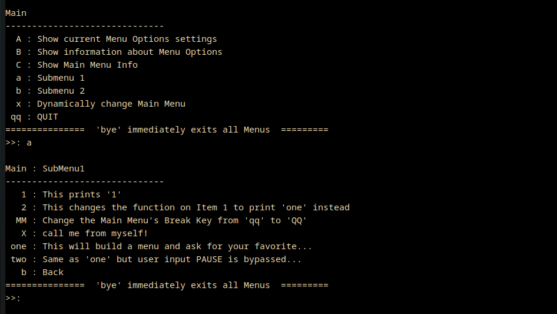

## juusmenu : golang menu package for terminal applications ##

December 2020:

juusmenu is an easy to use menu building system for use in Go terminal
apps. At the bottom of this document is a full program you can copy & paste
that demonstrates all the menu capabilities.

juusmenu is my first Golang project. I started learning Go recently,
and saw a need for a menu system to help me organize my testing and
learning, and keep my func main() clear. It was so much fun to develop
that I kept on with it until it had some real functionality.

juusmenu is free software, licensed under the GNU GPL, version 3.

### Features ###

  * Flexible in use. Unlimited number of menus (whether self-standing, "registered"
    Sub-Menus, or Choose One's) and any menu can be called at any time from any other
    menu.

  * Any menu can be run-time manipulated at any time by any other
    menu, even if the menu is currently running. 
		
  * A menu can be set to "Choose One" mode for those
    yes/no/maybe/cancel menu types.

  * Menu Entries can run any possible func()

  * It is written in pure Go, no other dependencies.



-------------------------------------------------------------------------------

### Install ###

Install in the usual Go manner with: 

``` go
go get github.com/Juuliuus/juusmenu
```

-------------------------------------------------------------------------------

The juusmenu_example code below can be used to take the menu system out
for a test drive...

-------------------------------------------------------------------------------

``` go
package main

import (
	"fmt"
	"math"
	"strconv"

	jm "github.com/Juuliuus/juusmenu"
)

//these menu vars can of course be local or function results,
//but I use global here for the purposes that this
//example code uses simplyfing function calls
var (
	menuMain   *jm.Menu
	menuSub1   *jm.Menu
	menuSub2   *jm.Menu
	menuSubSub *jm.Menu
	dummyMenu  *jm.Menu
)

const (
	muMyMainID = iota
	muMySub1ID
	muMySub2ID
	muMySubSubID
)

func main() {
	//for brevity most error conditions are not checked.
	//but there gives very few fatal errors in this menu system
	//usually you are informed that there was an irregularity
	//and the sytem will run given what its got.
	//it also, according to MenuOptions settings, will display
	//"error" conditions directly, useful for debugging.

	//MenuOptions lets you customize behaviour and appearance for all menus
	jm.MenuOptions.SetKillPhrase("bye")
	jm.MenuOptions.AlignRight()

	//Create the Menus.
	//first created Menu is automatically set to be the MainMenu
	//MainMenu designation is used primarily internally.
	//The param is the Menu's Title
	menuMain = jm.NewMenu("Main")
	menuSub1 = jm.NewMenu("SubMenu1")
	menuSub2 = jm.NewMenu("SubMenu2")
	menuSubSub = jm.NewMenu("SubSubMenu")
	//this will be a menu that is not initialized for example purposes
	dummyMenu = jm.NewMenu("dummy Menu")

	//Upon creation each menu is assigned an ID starting at -1 and decreasing.
	//Optionally you can, of course, set your own ID's for switch statements and so on.
	menuMain.SetID(muMyMainID)
	menuSub1.SetID(muMySub1ID)
	menuSub2.SetID(muMySub2ID)
	menuSubSub.SetID(muMySubSubID)

	//for clarity and less clutter I will build the menus in separate functions
	buildMain(menuMain)
	buildSub1(menuSub1)
	buildSub2(menuSub2)
	buildSubSub(menuSubSub)

	//setting up a confirmation of exit for example purposes
	exitFlag := false
	menuExit := jm.NewMenu("Really Exit?")
	menuExit.SetMenuBreakItem("c", "cancel", func() {})
	menuExit.AddMenuEntry("e", "Exit", func() { exitFlag = true })
	menuExit.SetChooseOne(true)

	//change as you like, but start with '1' to get familiar
	youChooseMethod := 1

	//I only use a for loop here to demonstrate re-starting the system
	for {

		//start the menu system
		switch youChooseMethod {
		case 1:
			//will start the MainMenu automatically
			jm.MenuSystem.StartMenuSystem()
		case 2:
			//if you start the MainMenu directly it is basically equivalent to case 1
			menuMain.Start()
		case 3:
			//You don't have to follow MainMenu & "SubMenu" Menu System conventions.
			//You can start any menu at any time but then you will need to manage them
			menuSub2.Start()
		}

		//example of re-setting the menu system after an (accidental?) use of the  killPhrase
		if jm.MenuSystem.WasKilled() {
			//user typed in the "killPhrase"
			jm.MenuSystem.UnKill() //reset menus to function properly
			//here I use a menu, one can also set up user input functions
			//with jm.GetUserInput("prompt")
			menuExit.Start()
			//they might have used the killPhrase on the ChooseOne menu too!
			exitFlag = exitFlag || jm.MenuSystem.WasKilled()
			if exitFlag {
				break
			} else {
				continue
			}
		} else {
			//regular Menu Break (exit) key was used
			break
		}
	}
}

func buildMain(menu *jm.Menu) {
	//I could use a single func() with a switch statement using either menu.Title or menu.GetID()
	//but I thought individual funcs will be easier to read for newer programmers.

	//SetMenuBreakItem: the key to leave the menu
	//it is ok to call SetMenuBreakItem any number of times both before and after
	//the menu is Start()-ed. It is its own add/edit function. You should try to be careful
	//to not conflict with the break key, but no worries. There is a lot of validation code
	//and you will be notified if you, or your code, has made this mistake.
	menu.SetMenuBreakItem("qq", "QUIT", func() { fmt.Println("Ok, quitting. Bye-Bye!") })

	//using AddSubMenu() ensures smooth flow between menus. Another method will be shown later
	//Of course, menuSub1 & 2 must be at least created, they can be already filled in or not.
	menu.AddSubMenu(menuSub1, "a", "Submenu 1")
	menu.AddSubMenu(menuSub2, "b", "Submenu 2")

	//now lets add regular menu entries
	menu.AddMenuEntry("A", "Show current Menu Options settings", func() {
		fmt.Println(jm.MenuOptions)
		//note that the embedded func bracket is closed by the paren. on the same line!
		//this construction is necessary, or you will get compile error:
		//  syntax error: unexpected newline, expecting comma or )
	})
	menu.AddMenuEntry("B", "Show information about Menu Options", func() {
		fmt.Println(jm.MenuOptions.InfoMenuOptions())
	})
	menu.AddMenuEntry("C", "Show Main Menu Info", func() {
		fmt.Println(menuMain)
	})

	//runtime manipulation of menus
	menu.AddMenuEntry("x", "Dynamically change Main Menu", func() {
		fmt.Println("This will change all menu values to numbers, and align the menu to the left, and then remove this 'x' entry")
		jm.MenuOptions.AlignLeft()

		menu.SetMenuBreakItem("33", "QUIT", func() { fmt.Println("33, over and out.") })
		menu.ChangeMenuEntry("", "A", "1")
		menu.ChangeMenuEntry("", "B", "2")
		menu.ChangeMenuEntry("", "C", "3")
		menu.ChangeMenuEntry("Submenu 1 (now its 4)", "a", "4")
		menu.ChangeMenuEntry("Submenu 2 (now its 5)", "b", "5")
		menu.RemoveMenuEntry("x")
	})
}

func buildSub1(menu *jm.Menu) {
	//Send in an empty func() on Break Items if you don't want a message or action
	menu.SetMenuBreakItem("b", "Back", func() {})
	menu.AddMenuEntry("X", "call me from myself!", func() {
		fmt.Println("I'm calling me...the system is smart enough to know I'm already showing.")
		menu.Start()
	})
	menu.AddMenuEntry("1", "This prints '1'", func() {
		fmt.Println("1")
	})
	//changing an existing entry's func()
	menu.AddMenuEntry("2", "This changes the function on Item 1 to print 'one' instead", func() {
		menu.ChangeMenuEntry("This prints 'one'", "1", "")
		menu.ChangeMenuEntryFunc("1", func() {
			fmt.Println("one")
		})
		menu.RemoveMenuEntry("2")
		fmt.Println("Mischief Managed")
	})
	//You can also, of course, change other menus from anywhere
	menu.AddMenuEntry("MM", "Change the Main Menu's Break Key from 'qq' to 'QQ'", func() {
		menuMain.SetMenuBreakItem("QQ", "qUIT", func() {
			fmt.Println(fmt.Sprintf("My byebye messgage was changed by Menu: %s", menu.Title))
		})
		fmt.Println("change Menu Main quit key.")
	})
	menu.AddMenuEntry("one", "This will build a menu and ask for your favorite...", func() {
		//this is a built on the fly Menu. Even though it is a menu, it wass not declared as a SubMenu
		//therfore it is treated and responds as a function. See choice 'two' below for a
		//way to bypass this behaviour
		tempMenu := buildChooseOne()
		tempMenu.Start()
	})
	menu.AddMenuEntry("two", "Same as 'one' but user input PAUSE is bypassed...", func() {
		msg := "This will print a notification message about the bypass IF MenuOptions.pauseOnOutput=true\n\n"
		//a pause for you to read the message above
		jm.WaitForInput(&msg)
		//SkipFunctionNotification() is a temporary flag that bypasses pauseOnOutput if it is set. It
		//Provides a way to make non-declared SubMenus behave like declared SubMenus which flow immediately back,
		//Or use it as needed it you don't want to pause after a particular function returns.
		//=== NOTE that this is called on the WRAPPING menu!
		menu.SkipFunctionNotification()
		tempMenu := buildChooseOne()
		tempMenu.Start()
	})
}

func buildSub2(menu *jm.Menu) {
	//one can also sort the Menu in descending order
	//However, the Break Key will always be at top or bottom respectively
	menu.SortDescending()
	menu.SetMenuBreakItem("b", "Back", func() { fmt.Println("Ok. going back.") })
	menu.AddSubMenu(menuSubSub, "5", "Sub-Sub menu")
	//this will print information messages because dummyMenu was never filled in
	menu.AddSubMenu(dummyMenu, "4", "dummyMenu: created but never initialized!")
	menu.AddMenuEntry("3", "System Square Root of 2", func() { fmt.Println(math.Sqrt(2)) })
	menu.AddMenuEntry("2", "Square Root of Square Root of 2 func()", func() { fmt.Println(getSqrSqrRoot(2)) })
	menu.AddMenuEntry("1", "SqrRoot of SqRoot: input a number...", func() {
		// so now we need an input function
		//this could be easily a separate function call but
		//I write here in-line
		out := jm.GetUserInput("Enter a number:")
		if out == "" {
			return
		}
		if out == "1" {
			fmt.Println("Sorry, 1 is too boring, changing it to 42")
			out = "42"
		}
		outFloat, err := strconv.ParseFloat(out, 64)
		if err != nil {
			fmt.Println("Error: ", err)
			return
		}
		fmt.Println(getSqrSqrRoot(outFloat))
	})
}

func buildSubSub(menu *jm.Menu) {
	menu.SetMenuBreakItem("b", "Back", func() { fmt.Println("Ok. going back.") })
	menu.AddMenuEntry("M", "Return to Main Menu", func() {
		//you can call Start() method any time. If the menu is already Running
		//it will drop back down to it. If not, it will start it.
		menuMain.Start()
	})
	menu.AddMenuEntry("P", "Return to SubMenu 2, of course you can use 'b' too", func() {
		menuSub2.Start()
	})
	menu.AddMenuEntry("1", "In English", func() { fmt.Println("one") })
	menu.AddMenuEntry("2", "In Deutsch", func() { fmt.Println("zwei o. zwo") })
	menu.AddMenuEntry("42", "In English", func() { fmt.Println("The Answer!") })
}

func buildChooseOne() *jm.Menu {
	//A ChooseOne menu is a menu like yes/no/maybe
	//it closes automatically after the user has made a single choice
	result := jm.NewMenu("Preferences")
	result.SetChooseOne(true)
	result.SetMenuBreakItem("c", "Cancel. I can't decide!", func() { fmt.Println("\nUser canceled\n") })
	result.AddMenuEntry("1", "Kittens", func() {
		fmt.Println("\nYes, they are so fuzzy!\n")
	})
	result.AddMenuEntry("2", "Puppies", func() {
		fmt.Println("\nOh yeah, they are so funny!\n")
	})
	result.AddMenuEntry("3", "Pizza", func() {
		fmt.Println("\n  <ummm pizzzaaa>   D'Oh!\n")
	})
	result.AddMenuEntry("M", "Never mind. Go back to Main Menu", func() {
		menuMain.Start()
	})
	return result
}

func getSqrSqrRoot(n float64) float64 {
	//using your own written func()s
	return math.Sqrt(math.Sqrt(n))
}
```

-------------------------------------------------------------------------------
##History##

v1.0.0 December 2020
